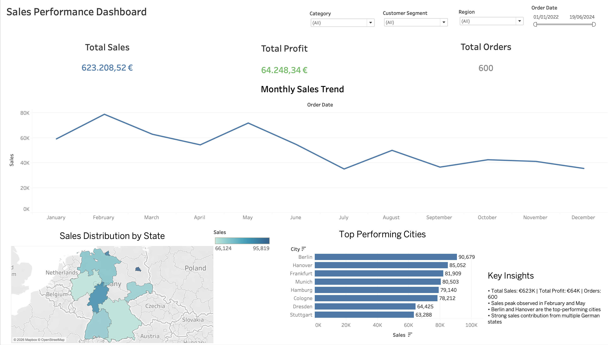

# 📊 Tableau Sales Performance Dashboard

This project presents an **interactive Sales Performance Dashboard** built using **Tableau** to analyze sales data across Germany. The dashboard provides insights into overall sales performance, profit trends, regional sales distribution, and top-performing cities.

The goal of this project is to demonstrate how **data visualization and business intelligence tools** can help organizations monitor performance, identify growth opportunities, and make data-driven decisions.

---

## 📸 Dashboard Preview

---

## 🎯 Business Objective

Companies often struggle to quickly understand their sales performance across different regions, customer segments, and product categories. Without a centralized dashboard, identifying high-performing areas or declining trends becomes difficult.

This dashboard solves that problem by providing:

• A clear overview of key business metrics
• Sales trend analysis over time
• Regional performance insights
• Identification of top-performing cities

This allows stakeholders to **track performance and make strategic decisions faster.**

---

## 📊 Dashboard Features

### 1️⃣ Key Performance Indicators (KPIs)

The dashboard highlights three major business metrics:

• **Total Sales:** €623K
• **Total Profit:** €64K
• **Total Orders:** 600

These KPIs provide a quick overview of business performance.

---

### 2️⃣ Monthly Sales Trend

A line chart visualizes **monthly sales trends**, helping identify seasonal patterns and demand fluctuations throughout the year.

This helps businesses:

• Identify peak sales months
• Monitor declining sales periods
• Plan inventory and marketing strategies

---

### 3️⃣ Sales by State (Map Visualization)

A geographic map shows **sales distribution across German states**, allowing users to quickly understand regional sales performance.

Benefits:

• Identify high-performing regions
• Discover underperforming markets
• Support regional sales strategies

---

### 4️⃣ Top Cities by Sales

A bar chart highlights the **top-performing cities based on sales revenue**, helping businesses understand where most revenue is generated.

Example insights:

• Berlin generates the highest sales
• Hanover and Frankfurt also contribute significantly to revenue

---

### 5️⃣ Interactive Filters

The dashboard includes dynamic filters to allow deeper exploration of the data:

• **Region**
• **Category**
• **Customer Segment**
• **Order Date**

Users can interact with these filters to analyze specific segments and uncover deeper insights.

---

## 🔍 Key Insights

• The business generated **€623K in total sales** with **€64K in profit** across **600 orders**.

• Sales show strong peaks during **February and May**, suggesting seasonal demand patterns.

• **Berlin, Hanover, and Frankfurt** are the highest-performing cities.

• Multiple German regions contribute significantly to total revenue, indicating **balanced market distribution**.

• Interactive filters allow deeper analysis of performance by **region, category, and customer segment**.

---

## 🛠 Tools & Technologies Used

• **Tableau Desktop** – Data visualization and dashboard creation
• **Microsoft Excel** – Data source and preparation
• **Data Visualization Techniques** – Maps, bar charts, line charts, KPI metrics

---

## 📁 Project Files

Repository includes:

• Tableau dashboard file
• Dashboard preview image
• Documentation (README)

---

## 🚀 Future Improvements

Possible enhancements for this project include:

• Adding **profit margin analysis**
• Creating **customer segmentation insights**
• Including **forecasting for future sales trends**

---

## 👤 Author

**Nishant Suryawanshi**

Master’s Student – Frankfurt University of Applied Sciences
Aspiring **Data Analyst / Business Intelligence Analyst**

---

⭐ If you found this project useful or interesting, feel free to star the repository!
